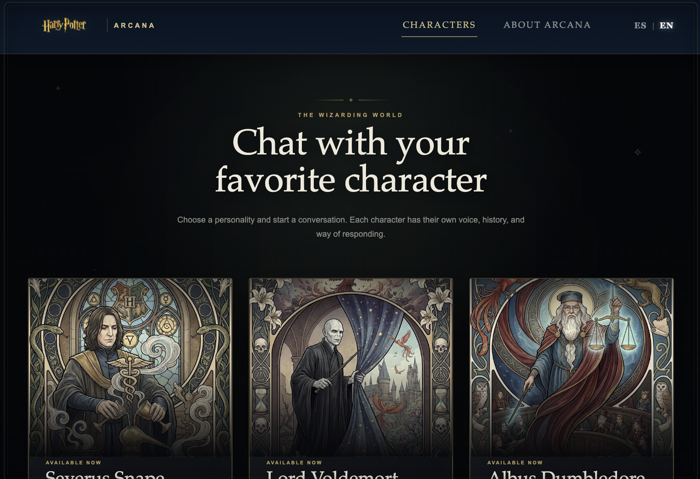
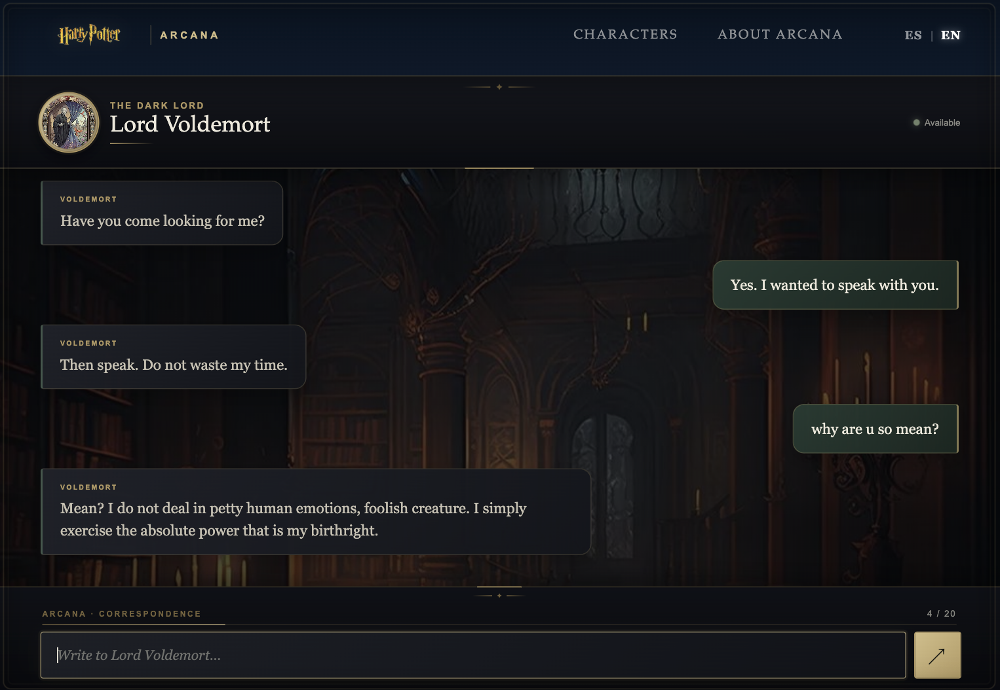

# ✦ Arcana

Interactive SPA chat application developed with **Vanilla JavaScript**, **Gemini AI**, and **Vercel** as the Module 3 Integrative Project at **Soy Henry**.

---

# 🌐 Live Demo

## Arcana

**https://proyecto-m3-solange-aimery.vercel.app**

---

# 💜 About the Project

Arcana is an interactive conversation experience that allows users to chat with characters from the magical world.

The application was developed as a **Single Page Application (SPA)** using Vanilla JavaScript, without frontend frameworks.

Users can select a character and start a conversation powered by **Google Gemini AI**. Each character has their own personality, communication style, and way of responding.

The application also includes conversation history, bilingual support, responsive design, connection states, error handling, and a message limit per character.

During development, the following concepts were applied:

- Single Page Application architecture.
- Vanilla JavaScript.
- ES Modules.
- History API.
- Client-side routing.
- Dynamic rendering.
- State management.
- LocalStorage.
- SessionStorage.
- Gemini AI integration.
- Conversation history.
- Mock error handling.
- Bilingual interface.
- Responsive design.
- Vercel deployment.

---

# 📸 Preview

### Home — Desktop



### Chat — Desktop



### Mobile

<div align="center">


</div>

---

# ✨ Features

- 🪄 Character selection.
- 💬 AI-powered conversations with Gemini.
- 🧙‍♂️ Three different characters with individual personalities.
- 🧠 Conversation context and history.
- 🌐 Spanish and English language support.
- 💾 Language preference persistence with LocalStorage.
- 🔄 SPA navigation without page reloads.
- 🛣️ Client-side routing with History API.
- 📱 Responsive design for desktop and mobile.
- 🔌 Connection status indicators.
- ⚠️ Error handling with mock responses.
- 🧪 Forced error simulation for testing.
- 🔢 Message limit of 20 messages per character.
- 🚫 Navigation lock while a message is being processed.
- 🧭 Custom 404 route.
- 🚀 Vercel deployment.

---

# 🚀 Technologies

- HTML5
- CSS3
- JavaScript
- ES Modules
- Google Gemini AI
- `@google/genai`
- Vercel

---

# 📋 Requirements

Before running the project, make sure you have installed:

- Node.js
- npm

You will also need a **Gemini API Key** to use the AI functionality locally.

---

# 📦 Installation

Clone the repository:

```bash
git clone <YOUR_GITHUB_REPOSITORY_URL>
```

Navigate to the project folder:

```bash
cd ProyectoM3
```

Install dependencies:

```bash
npm install
```

---

# ⚙️ Environment Variables

The Gemini API key is used on the server side through the Vercel Function.

Create the required environment variable:

```env
GEMINI_API_KEY=your_gemini_api_key
```

The API key should not be exposed in the frontend code or committed to the repository.

---

# ▶️ Running the Project

The project can be developed locally using Vercel.

Run:

```bash
npx vercel dev
```

The application will be available at:

```text
http://localhost:3000
```

---

# 🧭 SPA Routing

Arcana uses client-side routing with the **History API**.

The application includes the following routes:

| Route           | Description              |
| --------------- | ------------------------ |
| `/`             | Character selection      |
| `/home`         | Character selection      |
| `/chat`         | Character conversation   |
| `/about`        | Information about Arcana |
| Any other route | Custom 404 page          |

Navigation is handled without full page reloads.

The router also prevents navigation while a message is being processed.

---

# 💬 Characters

## Severus Snape

A serious, reserved, intelligent, sarcastic, and demanding professor.

His responses are designed to be formal, dry, elegant, and slightly sarcastic.

---

## Lord Voldemort

A cold, calculating, dominant, ambitious, and authoritarian character.

His responses use an elegant, threatening, and superior tone.

---

## Albus Dumbledore

A wise, calm, kind, reflective, and slightly mysterious character.

His responses are designed to be calm, elegant, patient, and occasionally philosophical.

---

# 🤖 Gemini AI

The application communicates with Google Gemini through a Vercel serverless function.

The frontend sends the following information:

- Message.
- Selected character.
- Conversation history.
- Selected language.

The request is sent to:

```text
/api/functions
```

The server then sends the conversation to Gemini together with the corresponding character instructions.

Each character has a specific system instruction that defines:

- Personality.
- Tone of voice.
- Communication style.
- Character behavior.
- Response length.
- Selected language.
- Conversation context.

The application uses a short response configuration so that characters normally respond with approximately two or three short sentences.

---

# 🧠 Conversation History

Arcana maintains the conversation context while the user is chatting with a character.

Previous messages are stored in the application's state and conversation history.

A portion of the conversation history is sent to Gemini together with each new message.

This allows the characters to maintain context instead of treating every message as an isolated conversation.

Conversations are also preserved during the current session so the user can continue a conversation without losing the messages already displayed.

---

# 🌐 Bilingual Support

Arcana supports two languages:

- Spanish
- English

The selected language is stored using `localStorage`, so the user's preference persists between sessions.

The language affects:

- Navigation.
- Character selection.
- Chat interface.
- Character information.
- Connection status.
- Message limit messages.
- Mock error responses.
- About page.
- Accessibility labels.
- Gemini character responses.

The language can be changed through the **ES / EN** selector in the navigation.

---

# ⚠️ Error Handling

Arcana includes error handling for Gemini failures.

When an error occurs:

1. The typing indicator disappears.
2. The connection status changes to interrupted.
3. A mock response is displayed.
4. The connection status returns to available after a short delay.

This allows the application to maintain a usable conversation experience even when the AI service is unavailable.

---

# 🧪 Forcing a Mock Error

Arcana includes a development mechanism to simulate a Gemini error.

Inside:

```text
src/services/geminiService.js
```

there is a constant:

```js
const FORCE_ERROR = false;
```

To intentionally trigger the error flow, temporarily change it to:

```js
const FORCE_ERROR = true;
```

Then run the application locally:

```bash
npx vercel dev
```

Open a character chat and send a message.

The application will intentionally throw an error before making the Gemini request.

The error-handling flow will then:

- Detect the error.
- Show the connection interruption state.
- Display the mock response.
- Restore the connection status.

After testing, change the value back to:

```js
const FORCE_ERROR = false;
```

This mechanism was implemented to verify that the application's fallback behavior works correctly.

---

# 🔢 Message Limit

Each character has a maximum of **20 user messages**.

The chat interface includes a visual message counter:

```text
0 / 20
```

The progress indicator updates as the user sends messages.

When the limit is reached:

- The input is disabled.
- The send button is disabled.
- The progress reaches `20 / 20`.
- The input placeholder indicates that the limit has been reached.
- The user can no longer send additional messages for that character.

The message count is maintained independently for each character.

---

# 📱 Responsive Design

Arcana was designed to work across different screen sizes.

The interface adapts to:

- Desktop screens.
- Tablets.
- Mobile devices.

Responsive behavior was implemented for:

- Navigation.
- Character cards.
- Character selection.
- Chat layout.
- Message bubbles.
- Chat input.
- Send button.
- Language selector.
- Decorative elements.

The mobile experience also prevents the browser from automatically zooming into the message input when the user starts typing.

---

# 🗂️ Project Structure

The project is organized using ES Modules and separates responsibilities between views, events, state, services, components, utilities, and routing.

```text
ProyectoM3/
│
├── api/
│   └── functions.js
│
├── docs/
│   └── AI.md
│
├── src/
│   ├── app.js
│   │
│   ├── assets/
│   │   └── img/
│   │
│   ├── components/
│   │
│   ├── data/
│   │
│   ├── events/
│   │
│   ├── router/
│   │
│   ├── services/
│   │
│   ├── state/
│   │
│   ├── utils/
│   │
│   ├── views/
│   │
│   └── styles.css
│
├── index.html
├── package.json
└── README.md
```

---

# 🧩 Architecture

Arcana follows a modular structure where each part of the application has a specific responsibility.

### Views

Responsible for rendering the different SPA screens:

- Home.
- Chat.
- About.
- 404.

### Router

Responsible for:

- Detecting the current route.
- Rendering the corresponding view.
- Handling navigation through the History API.
- Updating the active navigation item.
- Handling unknown routes.

### Events

Responsible for user interactions such as:

- Navigation.
- Character selection.
- Chat form submission.
- Language selection.

### State

Responsible for application and conversation state.

This includes:

- Selected character.
- Conversation history.
- User message count.
- Navigation lock state.

### Services

Responsible for communication with external services.

The Gemini service handles the communication between the frontend and the backend endpoint.

### Data

Contains the application's character information and initial conversations.

### Utils

Contains reusable functionality such as:

- Language management.
- LocalStorage handling.
- Path normalization.
- Localized values.

### Components

Contains reusable interface components and functionality used by the different views.

---

# 💾 Storage

Arcana uses browser storage for different purposes.

### LocalStorage

Used to persist information between sessions, including:

- Selected language.
- Character-related application preferences where applicable.

### SessionStorage

Used for information that should persist during the current browser session.

Conversation-related state is maintained so that the user can continue interacting with the selected character without losing the current context.

---

# 🔐 API Key Security

The Gemini API key is handled on the server side.

The frontend does not directly expose the API key.

The frontend communicates with the Vercel serverless function:

```text
/api/functions
```

The serverless function uses the environment variable:

```text
GEMINI_API_KEY
```

to authenticate requests to Gemini.

This prevents the API key from being included in the public frontend JavaScript code.

---

# 🚀 Deployment

Arcana is deployed using **Vercel**.

Live application:

**https://proyecto-m3-solange-aimery.vercel.app**

The Gemini API key is configured as an environment variable in Vercel.

The serverless function is responsible for communicating with Gemini so that the API key remains on the server side.

---

# 🤖 Use of Artificial Intelligence

Artificial Intelligence tools were used throughout the development process as support for learning, research, planning, debugging, and implementation.

Two main tools were used:

- **Google NotebookLM** — used to review and work with the theoretical material provided for the module, clarify concepts, and develop prompts based on the course content.
- **ChatGPT** — used as a development assistant throughout the implementation of the application, including architecture, debugging, JavaScript, SPA routing, Gemini integration, responsive design, bilingual support, and deployment.

AI was used as a support tool during the learning and development process. The implementation, integration, testing, and final decisions were carried out as part of the development process of Arcana.

👉 [View AI usage documentation](/docs/Ai.md)

---

# 👩🏻‍💻 Author

## Solange Aimery

Developed as part of the **M3 Integrative Project — Soy Henry**.

GitHub:

**<https://github.com/solangeAimery98>**

---

# ✦ Arcana

An interactive magical correspondence experience powered by artificial intelligence.
