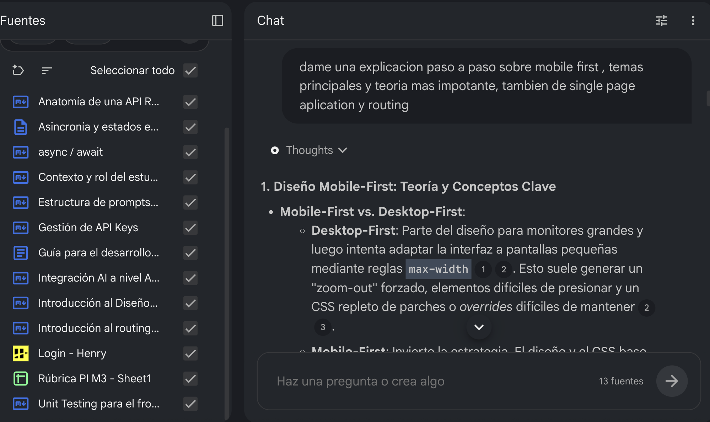
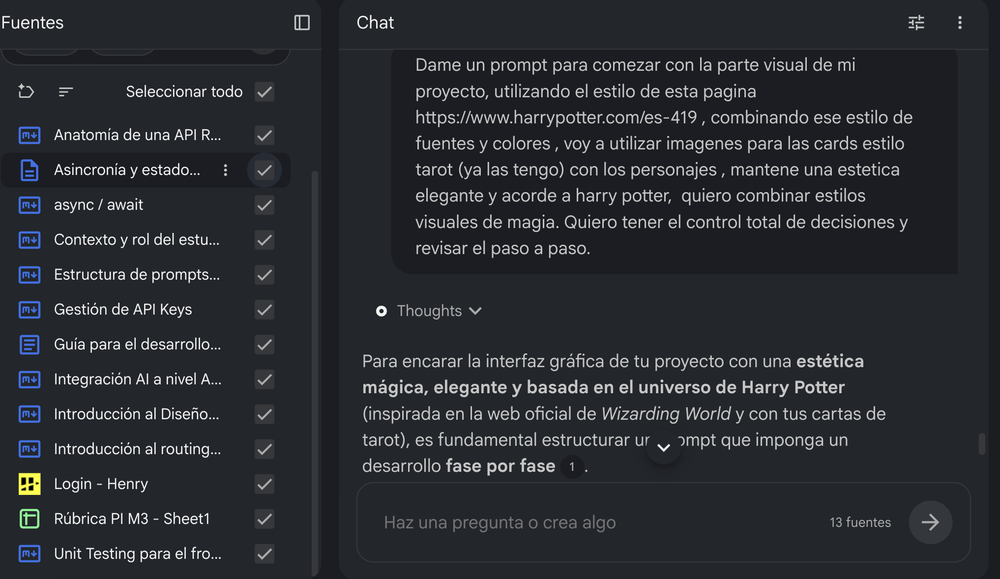
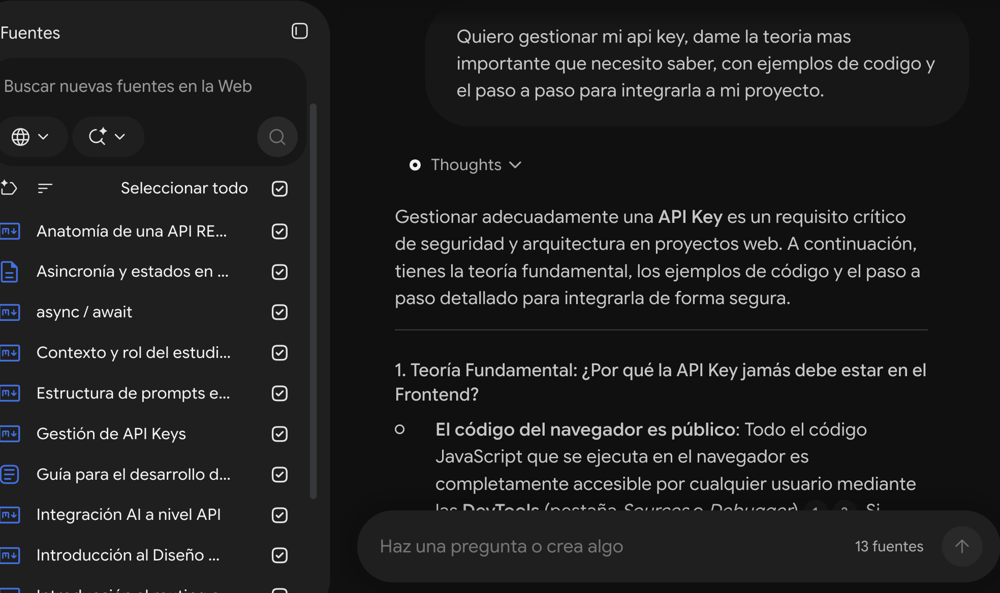

# 🤖 Use of Artificial Intelligence

This document describes how Artificial Intelligence tools were used during the development of Arcana.

AI was used as a learning and development support tool throughout the project.

---

## 📚 Google NotebookLM

Google NotebookLM was used primarily as a study and theoretical review tool.

The theoretical material provided for Module 3 was uploaded to NotebookLM so that I could:

- Review the concepts covered during the module.
- Ask questions about the theoretical material.
- Clarify concepts before implementing them.
- Connect theoretical concepts with the Arcana project.
- Create prompts based on the course material.
- Use the module documentation as a reference while developing the application.

The objective was to use the course material as the main source of information when reviewing the theoretical concepts.

### Examples

---

## 💻 ChatGPT

ChatGPT was used as a development assistant during the implementation of Arcana.

It was used for different stages of the project, including:

- Planning the application architecture.
- Understanding and implementing SPA routing.
- Working with the History API.
- Organizing the project using ES Modules.
- Developing and debugging JavaScript functionality.
- Implementing the Gemini API integration.
- Working with conversation history and application state.
- Developing character-specific prompts and personalities.
- Implementing bilingual support.
- Debugging responsive behavior.
- Improving the mobile user experience.
- Implementing error handling and mock responses.
- Debugging deployment issues.
- Reviewing and improving the project documentation.

### Examples

---

## 🧪 AI-assisted development

AI was used as a support tool rather than as an autonomous development system.

The generated suggestions were reviewed, adapted, tested, and integrated according to the requirements of the project.

The final architecture, implementation, visual decisions, integration of the different modules, testing, debugging, and deployment were carried out as part of the development process of Arcana.

---

## 📸 Additional examples

Additional screenshots showing the use of AI during the development process can be found in:

[`src/assets/img/`](../src/assets/img/)
